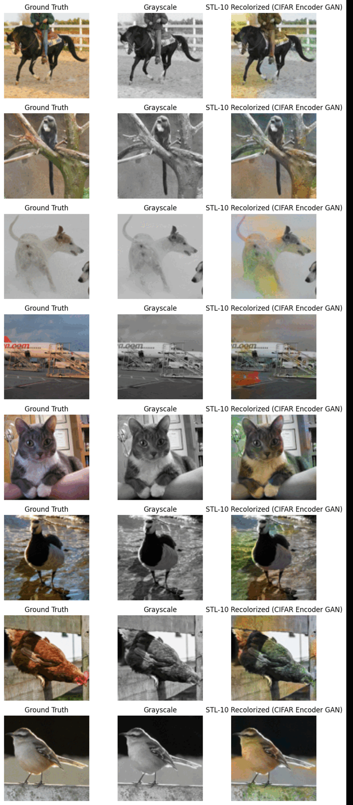
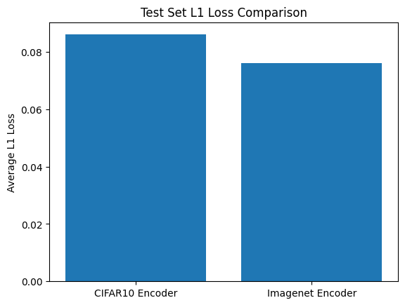

# ColourGAN - Image Colorization using GANs

## Tech Stack

- Python, PyTorch, FastAI
- CNNs, U-Nets, PatchGANs
- CIFAR-10, STL10 datasets
- Lab color space preprocessing

## Description

This project applies concepts from CNNs and GANs to the classic problem of image colourization. I was especially drawn to Moein Shariatnia's approach as highlighted in their [Medium article](https://medium.com/data-science/colorizing-black-white-images-with-u-net-and-conditional-gan-a-tutorial-81b2df111cd8) due to its light demand on computer hardware. Specifically, I wanted to explore 2 cases:

1. **Case 1**: Using a pre-trained encoder trained on the same dataset as train/test.
2. **Case 2**: Using a pre-trained encoder trained on a different, lower/higher resolution dataset than train/test.

In both cases, I imported a pre-trained encoder and used fastai's `DynamicUnet` to create the U-Net model used as the generator. Then, like in the article, I pretrained the U-Net with L1 loss before using a PatchGAN discriminator to train the generator with adversarial loss (binary cross-entropy from the discriminator) combined with reconstruction loss (L1 between predicted and ground-truth ab channels). For CIFAR, I used chenyaofo's [pretrained resnet20 encoder](https://github.com/chenyaofo/pytorch-cifar-models), and for STL10, I used PyTorch's resnet18 encoder pretrained on ImageNet. I also used the same discriminator architecture as in the article, but with slight changes to match my datasets' smaller resolution.

## Case 1: Same Dataset

### Dataset

The dataset used for this case is the [CIFAR-10 dataset](https://www.cs.toronto.edu/~kriz/cifar.html). It consists of 60,000 32x32 color images in 10 classes, with 6,000 images per class. Following the approach in the article, I used only 8000 images from the dataset to train.

### Results

Below is a comparison of colourization pre- and post-GAN training:

  

We can see that the GAN is able to colourize the images better than the U-Net alone. The GAN is able to add more detail and realism to the images, making them look much more colourful. This follows the results in the article. An interesting thing I found was that the L1 loss is actually higher for the GAN than for the U-Net alone:

  

This is because the GAN drives the generator to be more daring and to add more detail to the images, which increases the L1 loss. However, our goal is not solely to minimize the L1 loss, but to make the images look more realistic.

# Case 2: Different Datasets

### Dataset

The dataset used for this case is the [STL10 dataset](https://cs.stanford.edu/~acoates/stl10/). I decided to use this dataset as its images are 96x96 - larger than CIFAR10, but smaller than ImageNet. However, the training set only contains 5000 images.

Here, I tested how well pretrained encoders transfer across datasets of differing resolutions and domains. Specifically, I compared an encoder trained on a smaller dataset (CIFAR-10, 32×32) and a larger one (ImageNet, 224×224) when colorizing STL10 (96×96).

### Results

Below is a comparison of colourization using encoders pretrained on CIFAR and ImageNet after GAN training:

  

We can see that the generator using the ImageNet encoder is able to colourize the images more convincingly than the one using the CIFAR encoder. This is likely because the ImageNet encoder has been trained on a larger and more diverse dataset, allowing it to learn more transferable features applicable to STL10. The CIFAR encoder, on the other hand, has been trained on a smaller and less diverse dataset, making it less capable of generalizing to the STL10 dataset. Indeed, this is reflected in the L1 loss:

  

However, the ImageNet encoder generator still has some issues with colour consistency, seen in areas with low contrast and detail, where domain mismatch leads to suboptimal features and less precise color reconstructions.

## Conclusion

In conclusion, I found that the GAN was able to colourize the images better than the U-Net alone, and that the ImageNet encoder was able to generalize better than the CIFAR encoder. However, there are still some issues with colour consistency, especially when the encoder is trained on a dataset with different resolution or domain characteristics. These results suggest that while large pretrained models offer stronger generalization, domain mismatch in terms of resolution and image characteristics still poses a challenge. Future work could include fine-tuning the encoder on STL10 to bridge the domain gap.

In the future, I would like to explore using different larger datasets for training, as well as experimenting with different generator and discriminator architectures and loss functions.
