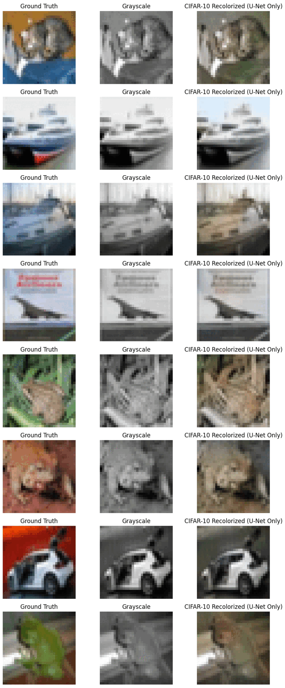
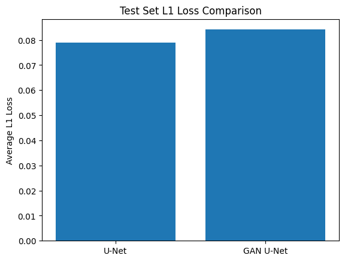

# ColourGAN - Image Colorization using GANs

## Description

The goal of this project was to apply what I had learned about CNNs and GANs to a classic problem. However, due to time and hardware constraints, I was drawn to Moein Shariatnia's approach as highlighted in their [Medium article](https://medium.com/data-science/colorizing-black-white-images-with-u-net-and-conditional-gan-a-tutorial-81b2df111cd8). Specifically, I wanted to explore 2 cases:

1. **Case 1**: Using a pre-trained encoder trained on the same dataset as train/test.
2. **Case 2**: Using a pre-trained encoder trained on a different, lower/higher resolution dataset than train/test.

In both cases, I imported a pre-trained encoder and used fastai's `DynamicUnet` to create the U-Net model used as the generator. Then, like in the article, I pretrained the U-Net with L1 loss before using a PatchGAN discriminator to train the generator with adversarial loss (cross entropy + L1).

## Case 1: Same Dataset

### Dataset

The dataset used for this case is the [CIFAR-10 dataset](https://www.cs.toronto.edu/~kriz/cifar.html). It consists of 60,000 32x32 color images in 10 classes, with 6,000 images per class. Following the approach in the article, I used only 8000 images from the dataset to train.

### Results

Below is a comparison of recolourization pre- and post-GAN training:

  

We can see that the GAN is able to recolourize the images better than the U-Net alone. The GAN is able to add more detail and realism to the images, making them look more like real photographs. This follows the results in the article. An interesting thing I found was that the L1 loss is actualy higher for the GAN than for the U-Net alone.

  

This is because the GAN is able to add more detail to the images, which increases the L1 loss. However, our goal is not to minimize the L1 loss, but to make the images look more realistic. The GAN is able to do this, even if the L1 loss is higher.
